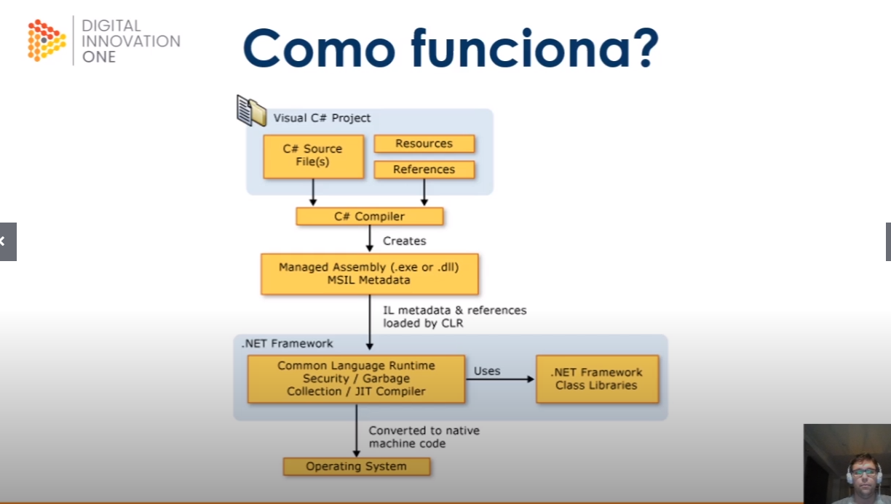

# O que é .net 
## Primeiros passos com .NET + C#

- Visual studio 97 
- Vb5 Visual FoxPro5 c++ 5 e J++ 
- 1999 scot gunthrie cria asp+ 
- jason zander ajudou a criar um common runtime para vb e c++ (CLR) 
- C# 1999 sun fez acordo para não mexer mais com java 
- 2000 .net 
- 2001 miguel icaza projeto mono reimplementação do .net opensource e multiplataforma 
- 2002 .net VS c# , C++ VB J# 
- 2003 .net 1.1 melhoraias na clr2 
- C# , Vb.net e J# passam por um compilador, tranforma em uma linguagem intermediaria, o clr pega e transforma para linguagem de máquina 

- 2005 VS 2.0  Desktop para windows, java opensource... 
- 2007 2008 .net 3.5 no VS 2008 , Silverlight, WPF (desk) e WCF (web) Asp.net mvc começa a se falar em windows azure (cloud)
- 2010 .net 4 com vs2010 com F#  azure é lançado anders hejlsberg começa a trabalhar com o Typescript 
- 2011 miguel de icaza inicia xamarin e faz c# rodar em android e ios 
- VS 2012 .net 4.5 c# 5.0 no vs 2012 , lançamento do TS 
- VS 2013 inicio do roslyn um novo compilador para c# e Vb.net  
- 2013 atua em Js e incorpora mais OpenSource  ASP>net mais consolidade com MVC Web APi e SIngaIR 
- 2014 Satya Nadella CEO da Microsoft direcionando o foco para cloud 
- .net foundation para gestão de projetos open source
 - 2014 windows azure passa a se chamar microsoft azure nova versão para ASP.NET vNext posteriormente chamado de asp.net core 
  - 2015 .net 4.6 com C# 6 VS Code Opensource e Multiplataforma 
  - 2016 microsoft adquire a xamarin e adiciona o produto como parte de sua stack .net e opensource lança o VS for mac 
  - 2016 .net core 1.0 opensource e multiplataforma 
  - 2017  .NEt 4.7 com c# 7.0 no Vs 2017 lançamento do .net core 2.0 
  - 20419 .net 4.8 com c# 7.3 no VS2019  .net core 3.0 com c# 8.0 
  - 2020 .net framework está pronto na versão 4.8 e deixa dde ser evoluido junt ocom ele wcf e asp.net webforms previsto lançamento .net 5

Em 2014 o empresário Satya Nadella compra a Microsoft e se torna sócio majoritário da empresa.
1997
C#
1970

  ## Como e aonde usar .net 
  >net tem as seguintes implementações : 
  - .net core 
  - .net framework 
  - mono 
  - universal windows plataform (UWP) 

  cada implementação inclui uma ou mais ;net runtimes 
  - .net core coreclr e core rt
  - .net framework clr 
  - mono  mono runtime 
  - universal windows plataform (UWP)  .net native 

 linguagens  suportadas 
  - C#  
  - F#  (funcional)
  - VB  (para estudo está sendo deprecated)

onde usar ? 

WPF , WIndows forms , UWP , ASp.net , azure , mobile xamarin , gaming unity , iot arm 32 e 64 , ai ml.net .net for apache spark . .net 5 

VS, VScode , Vs for mac ,CLI 

- Quem usa .net 
muitas empresas conhecidas 

## Iniciando com .net 

### Preparando o ambiente 

- Estou instalando o SDK 3.1.403 
- Instalar a CLR , CLI 
- dotnet --version
- VS 2019 (versão de estudo)

### conhecendo a CLI 

- dotnet --help 

Comandos do SDK:
  add               Adicionar um pacote ou uma referência a um projeto do .NET.
  build             Criar um projeto do .NET.
  build-server      Interagir com servidores iniciados por um build.
  clean             Limpar as saídas do build de um projeto do .NET.
  help              Mostrar a ajuda da linha de comando.
  list              Listar as referências de um projeto do .NET.
  msbuild           Executar comandos do MSBuild (Microsoft Build Engine).     
  new               Criar um novo projeto ou arquivo do .NET.
  nuget             Fornece comandos adicionais do NuGet.
  pack              Criar um pacote do NuGet.
  publish           Publicar um projeto do .NET para implantação.
  remove            Remover um pacote ou uma referência de um projeto do .NET. 
  restore           Restaurar as dependências especificadas em um projeto do .NET.
  run               Criar e executar uma saída de projeto do .NET.
  sln               Modificar os arquivos da solução do Visual Studio.
  store             Armazenar os assemblies especificados no repositório de pacotes do runtime.
  test              Executar testes de unidade usando o executor de testes especificado em um projeto do .NET.
  tool              Instalar ou gerenciar ferramentas que ampliam a experiência do .NET.
  vstest            Executar comandos do VSTest (Microsoft Test Engine).       

Comandos adicionais de ferramentas em pacote:
  dev-certs         Crie e gerencie certificados de desenvolvimento.
  fsi               Iniciar F# Interativo / executar scripts do F#.
  sql-cache         Ferramentas de linha de comando do cache do SQL Server.    
  user-secrets      Gerencie segredos do usuário de desenvolvimento.
  watch             Inicie um observador de arquivo que executa um comando quando os arquivos são alterados.

Execute 'dotnet [command] --help' para obter mais informações sobre um comando.

dotnet new --help 


Templates                                         Short Name               Language          Tags                       
----------------------------------------------------------------------------------------------------------------------------------
Console Application                               console                  [C#], F#, VB      Common/Console             
Class library                                     classlib                 [C#], F#, VB      Common/Library             
WPF Application                                   wpf                      [C#]              Common/WPF                 
WPF Class library                                 wpflib                   [C#]              Common/WPF                 
WPF Custom Control Library                        wpfcustomcontrollib      [C#]              Common/WPF                 
WPF User Control Library                          wpfusercontrollib        [C#]              Common/WPF                 
Windows Forms (WinForms) Application              winforms                 [C#]              Common/WinForms            
Windows Forms (WinForms) Class library            winformslib              [C#]              Common/WinForms            
Worker Service                                    worker                   [C#]              Common/Worker/Web          
Unit Test Project                                 mstest                   [C#], F#, VB      Test/MSTest                
NUnit 3 Test Project                              nunit                    [C#], F#, VB      Test/NUnit                 
NUnit 3 Test Item                                 nunit-test               [C#], F#, VB      Test/NUnit                 
xUnit Test Project                                xunit                    [C#], F#, VB      Test/xUnit                 
Razor Component                                   razorcomponent           [C#]              Web/ASP.NET                
Razor Page                                        page                     [C#]              Web/ASP.NET                
MVC ViewImports                                   viewimports              [C#]              Web/ASP.NET                
MVC ViewStart                                     viewstart                [C#]              Web/ASP.NET                
Blazor Server App                                 blazorserver             [C#]              Web/Blazor                 
Blazor WebAssembly App                            blazorwasm               [C#]              Web/Blazor/WebAssembly     
ASP.NET Core Empty                                web                      [C#], F#          Web/Empty                  
ASP.NET Core Web App (Model-View-Controller)      mvc                      [C#], F#          Web/MVC                    
ASP.NET Core Web App                              webapp                   [C#]              Web/MVC/Razor Pages        
ASP.NET Core with Angular                         angular                  [C#]              Web/MVC/SPA                
ASP.NET Core with React.js                        react                    [C#]              Web/MVC/SPA                
ASP.NET Core with React.js and Redux              reactredux               [C#]              Web/MVC/SPA                
Razor Class Library                               razorclasslib            [C#]              Web/Razor/Library/Razor Class Library
ASP.NET Core Web API                              webapi                   [C#], F#          Web/WebAPI                 
ASP.NET Core gRPC Service                         grpc                     [C#]              Web/gRPC                   
dotnet gitignore file                             gitignore                                  Config                     
global.json file                                  globaljson                                 Config                     
NuGet Config                                      nugetconfig                                Config                     
Dotnet local tool manifest file                   tool-manifest                              Config                     
Web Config                                        webconfig                                  Config                     
Solution File                                     sln                                        Solution                   
Protocol Buffer File                              proto                                      Web/gRPC                   

### Criando uma aplicação console.

cd consoleapp 
dotnet new console
explorer . (abre o explorer na pasta . )
code . (abre o vs code na pasta .)
dotnet run
dotnet restore ( igual o npm i)
dotnet build (restaura os pacotes e gera os binários)

dotnet build -h 
Argumentos:
  <PROJETO | SOLUÇÃO>   O arquivo de solução ou projeto para operar. Se um arquivo não for especificado, o comando pesquisará um no diretório atual.

Opções:
  -h, --help                            Mostrar a ajuda da linha de comando.
  -o, --output <OUTPUT_DIR>             O diretório de saída no qual os artefatos do build serão colocados.
  -f, --framework <FRAMEWORK>           A estrutura de destino na qual o build ocorrerá. A estrutura de destino também deve ser especificada no arquivo de projeto.
  -c, --configuration <CONFIGURATION>   A configuração a ser usada para compilar o projeto. O 
padrão para a maioria dos projetos é "Debug".
  -r, --runtime <RUNTIME_IDENTIFIER>    O runtime de destino no qual o build ocorrerá.
  --version-suffix <SUFIXO_DA_VERSÃO>   Definir o valor da propriedade $(VersionSuffix) a ser 
usado ao compilar o projeto.
  --no-incremental                      Não usar build incremental.
  --no-dependencies                     Não criar referências de projeto para projeto e criar 
somente o projeto especificado.
  /nologo, --nologo                     Não exibe a faixa de inicialização ou a mensagem de direitos autorais.
  --no-restore                          Não restaurar o projeto antes de compilar.
  --interactive                         Permite que o comando seja interrompido e aguarde a ação ou entrada do usuário (por exemplo, para concluir a autenticação).
  -v, --verbosity <LEVEL>               Definir o nível de detalhamento do MSBuild. Os valores permitidos são q[uiet], m[inimal], n[ormal], d[etailed] e diag[nostic].
  --force                               Force todas as dependências a serem resolvidas, mesmo 
que a última restauração tenha tido êxito.
                                        Isso equivale a excluir o project.assets.json.   


## Conhecendo o C# 

C# é tipada OO similar a C . C++ ou JAva 
suporta encapsulamento herança 

Executados no .net que inclui CLR e conjunto unificado de bibliotecas de classes 
o compilador é o Roslyn 
- o codigo é compilado em uma linguagem intermediaria IL 
- o codigo e os recursos de il são armazenados no disco em um arquivo executável chamado assembly , geralmente com uma extensão .exe ou dll 
- build -> C# gera -> li (a mesma para todas as linguagens)-> dll é o compilado em LI -> a clr carrega e compila em binário 
- CLR fornece : GArbage collector , Exception Handler e Resources manager 


### EStrutura de programa 

Os principais conceitos organizacionas em C# são : 

- programas 
- namespaces 
- tipos 
- membros 
- assemblies 

- extensão .cs 
- programas declaram tipos que contêm membros que são organizados em namespaces 
- classes e interfaces são exemplos de tipos 
- campos métodos propriedades e eventos são exemplos de membros 
- F5 abre o modo debug (para nos breakpoints )
- control + . dá dicas sobre incluir por exempo includes necessários 

## conhecendo variáveis e instruções 

tipos e variáveis 

- valor : separa o espaço na memoria e os dados estão nesse espaço da memória .Não é possivel qeu as operações afetem outra variável 
(exceto no caso das variáveis de parÂmetro ref e out )

tipos : sbyte short int long byte ushort uint ulong
char 
float double decimal 
bool 
enum struct nullable 

referencia 
não tem os dados somente guardam a referencia que está armazenada em outro espaço de memória 

tipos classe  : class object string 

tipo array : int[] int [,] , etc 

interface delegate 

### instruções do C# 

- ações que são expressas dentro de um bloco {}

if 
switch 
while 
do 
for 
foreach 


- auxiliares 

break 
continue 
return 
throw 
try chatch finally 
using 

-
### classes e objetos 

Classe é uma estrutura de dados que combina estado (campos) e ações (métodos)

Objetos são instâncias de uma classe; 

classes suportam herança e polimorfismo , mecanismo pelos quais podem ser derivadas , estendidas e especializadas a partir de uma classe base. 

``` C# 
namespace Classes.Herança
{
    public class Ponto
    {
        public int x, y;
        private int distancia;
        
        public Ponto(int x, int y)
        {
            this.x = x;
            this.y = y;
        }

        protected void CalcularDistancia()
        {
            //Faz alguma coisa...
            CalcularDistancia2();
        }

        private void CalcularDistancia2()
        {
            //Faz alguma coisa...
        }

        public virtual void CalcularDistancia3()
        {
            //Faz alguma coisa...
        }
    }
}

```

```C#
using System;

namespace Classes
{
    class Program
    {
        static void Main(string[] args)
        {
            Console.WriteLine("Hello World!");
        }
    }
}


```

- operador new

- Ponto p1 = new Ponto (0,0);

p1 apenas referencia um objeto em outro lcoal da memoria 

a memória ocupada por um objeto é recuperada automaticamente quando o objeto não está mais acessível. Não se delacola explicitamente objetos em C# 

- Membros : Estáticos ou da instância 

- Estáticos : Pertencem a classe e membros pertencem ao objeto 

- Constantes variáveis , métodos, propriedades, construtores, ... 

- Acessibilidade: 
Public
protected (classe e as que herdam a classe tem acesso )
internal (só acessado de dentro do assembly do qual faz parte se tem dois projects se um tem um membro internal o outro nao enxerga  )
e 
private acesso somente da classe no qual está contido 

- herança : Classe base pode especificar clase basem herdando os membros public , internal e protected da classe base 

- omitir uma especificação é o mesmo que derivar do tipo object  

-métodos : membro que implementa uma ação que pode ser executada por um obejeto ou classe 

- podem ter uma lista de parametros que representam valores ou referencias de variaveis passadas para o método  e um tipo de retorno , que especifica o tipo do valor calculado e retornado pelo método 

: (dois pontos) significa herança (só posso herdar de uma classe )

public class Ponto3D : Ponto

- Ponto 3d herda tudo que for public , protected ou internal de ponto 

privado você nao tem acesso de outra classe 


- public virtual void CalcularDistancia3()

virtual : permite que uma classe filha sobrescreva a atuação da classe pai 

public override void CalcularDistancia3()
public override sobrescreve as virtual da classe pai 


Estático : não pertence a instancia , pertence a classe pode ser chamado por : 
Ponto3d.Calcular(); 

ele não precisa de um objeto instanciando a classe para chamar um método da classe 

### Método : 

ref 


```C#
      static void InverterSemRef( int x,  int y)
        {
            int temp = x;
            x = y;
            y = temp;
        }

        static void InverterComRef(ref int x, ref int y)
        {
            int temp = x;
            x = y;
            y = temp;
        }

        public static void Inverter()
        {
            int i = 1, j = 2;
             InverterSemRef(i, j);
            System.Console.WriteLine($"{i} {j}");    // Escreve "1 2"

            InverterComRef(ref i, ref j);
            System.Console.WriteLine($"{i} {j}");    // Escreve "2 1"
        }
    }

```
- out 
na propria c hamada do método vc preenche a variável de retorno 
```C#
  static void Dividir(int x, int y, out int resultado, out int resto) 
        {
            resultado = x / y;
            resto = x % y;
        }
        
        public static void Dividir() 
        {
            Dividir(10, 3, out int resultado, out int resto);
            System.Console.WriteLine("{0} {1}", resultado, resto);	// Escreve "3 1"
        }
```

### Structs interfaces e enum 

#### Structs

estruturas de dados que contem membros de dados e membros de ação mas diferente das clases , as structs são tipo de valor e não requerem alocação de heap (local onde o valor de fato está armazenado) elas são alocadas na stack 

uma variável de um tipo struct armazena diretamente os dados da estrutura (não tem heap)enqaunto uma variável de um tiopo de classe armazena uma referencia a um objeto alocado na memória (heap) 

- Não aceitam herança 

- são uteis para pequenas estruturas de dados que possuem semantica de valor , numeros complexos, pontos em coordeandas , pares chave valor , etc 

- com structs fazemos menos alocações de memórias 

- exemplo classe ponto 

Obs: Construtores de struct são chamados com o operador new , semelhante a classe mas em vez de alocar dinamicamente um objeto no heap, gerenciado e retornar uma referencia a ele, um construtor struct simplesmente retorna o proprio valor struct (normalmente em um local temporário na stack)  e ess evalor é copiado conforme necessário.

#### Interface e Enums 

Interface é um contrato implementado por classes ou por structs

- contém métodos , propriedades, eventos e indexadores 

- não implementa os membros que define, apenas sua assinatura 

- podem empregar herança multipla 

- definindo quatro interfaces com herança :


```C#
interface IControl
{
  void Paint();
}
interface IListBox
{
  void SetText(string text);
}
interface IComboBox:ITextBox , IListBox {}
interface IDataBound {
  void Bind (Binder b);
}
public class EditBox: ICombobox , IDataBound 
{
  public void Paint();
  public void SetText(string text) {}
  public void Bind (Binder b)  { }
}
``` 
(IOC - Inversion of control) assunto avançado para pesquisar 

### Enums 

Tipo de valor distinto com um conjunto de constantes nomeadas 

use enumeracoes para definir um tipo que pode ter um conjunto de valores discretos. Usam um dos tipos de valor integral como armazenamento subjacente. FOrnecem significado semânctico aos valores discretos 

ex: Status de uma nota fiscal (1 emitida , 2 cancelada  ... )

ex : 
``` C#
enum Cor
{
  Vermelho, 
  Verde, 
  Azul
}

static void EscreveCor (Cor cor)
{
  switch (cor)
  {
    case Cor.Vermelho:
      Console.WriteLine ("Vermelho");
      break; 
    case Color.Verde: 
      Console.WriteLine ("Verde");
      break; 
  }
}
```

- Quando o tipo subjacente não é declarado , é atribuido inteiro 

ex : 
``` C#

enum Alinhamento: sbyte
{
    Esquerda = -1 , 
    Centro = 0 , 
    Direita = 1 , 

}
```

## Uma Síntese do que é .NET

### Revisão interodutória 


dotnet new console -n Revisao 

mudamos o lanch.json para "console":"integratedTerminal" senão não conseguimos usar o terminal do Vscode para fazer readline 
.vscode\launch.json


